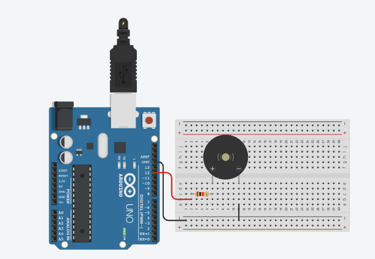

# Música com buzzer passivo
 Neste experimento um buzzer passivo na porta 12 será ativado tocando as notas musicais Dó, Ré, Mi, Fá, Só, Lá e Si repetidamente.    

 <b><a href="https://www.tinkercad.com/things/4hGy7VBRIFE">Clique Aqui</a></b> para ver o projeto em Tinkercard.com!
 
## Lista de componentes:

- 1  Arduíno UNO R3
- 1  Um cabo de conexão USB
- 1  Placa de prototipação (Protoboard)
- 1  Buzzer passivo
- 1  Resistor de 220 Ω ohms
- 4 Jumpers (macho-macho)

## Esquema do projeto

